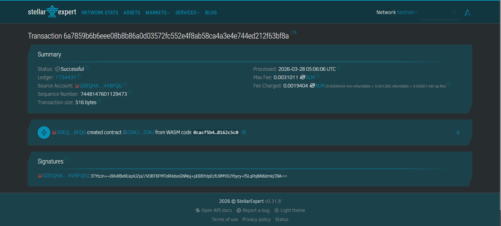

# Stellar To-Do DApp

**Stellar To-Do DApp** - Blockchain-Based Decentralized Task Management System

## Project Description

Stellar To-Do DApp is a decentralized smart contract solution built on the Stellar blockchain using Soroban SDK. It provides a simple yet powerful platform for managing daily tasks directly on the blockchain. By leveraging decentralized storage, the application ensures that all tasks are securely stored, transparent, and resistant to tampering.

The system allows users to create tasks, view task lists, mark tasks as completed, and delete tasks. Each task is uniquely identified and stored within the smart contract’s instance storage, ensuring persistence, reliability, and integrity of data without relying on centralized services.

---

## Project Vision

Our vision is to transform productivity tools by leveraging blockchain technology:

* **Decentralizing Task Management**: Eliminating dependency on centralized task management platforms
* **Ensuring Data Ownership**: Giving users full control over their tasks and productivity data
* **Maintaining Integrity**: Ensuring tasks cannot be altered arbitrarily without user interaction
* **Enhancing Transparency**: All task operations are verifiable on-chain
* **Building Trustless Productivity Tools**: Users rely on code, not corporations, for data security

We aim to create a future where productivity tools are private, secure, and fully owned by their users.

---

## Key Features

### 1. **Task Creation**

* Easily create new tasks with a single function call
* Each task includes:

  * Unique ID
  * Task title
  * Completion status
* Automatically stored on the blockchain

---

### 2. **Task Retrieval**

* Retrieve all tasks in one call
* Structured data format for easy frontend integration
* Real-time reflection of blockchain state
* Efficient access to task lists

---

### 3. **Task Completion**

* Mark tasks as completed
* Update task status directly on-chain
* Enables tracking of progress
* Persistent state change stored securely

---

### 4. **Task Deletion**

* Delete tasks using their unique ID
* Immediate update to stored task list
* Efficient storage management
* Permanent removal from contract storage

---

### 5. **Transparency & Security**

* All actions are recorded on the blockchain
* Tamper-resistant data storage
* Secure and verifiable operations
* Protection against unauthorized manipulation

---

### 6. **Stellar Network Integration**

* Utilizes fast and low-cost Stellar network
* Built using Soroban Smart Contract SDK
* Scalable for increasing task data
* Compatible with other Stellar-based applications

---

### **Contract Details**
* Contract Address: CDKJDUAWITBDOZJBYT4KPTIIW7O6ND545GDAVVOYZ3FF25D7CU2AZOKJ
* Screenshot: screenshot.png

## Contract Details

* Contract Address: *(Isi dengan address hasil deploy kamu)*
* Screenshot:
  

---

## Future Scope

### Short-Term Enhancements

1. **Task Deadlines**

   * Add due dates to tasks
   * Improve time management

2. **Priority Levels**

   * Low, Medium, High priority classification
   * Better task organization

3. **Task Filtering**

   * Filter by completed / pending
   * Improve usability

4. **Search Functionality**

   * Search tasks by keyword
   * Faster navigation in large lists

---

### Medium-Term Development

5. **Multi-User Support**

   * Tasks linked to user wallet address
   * Personal task isolation

6. **Collaborative Tasks**

   * Shared tasks between multiple users
   * Permission-based access

7. **Notification Integration**

   * Off-chain alerts for deadlines
   * Task reminders

8. **Task History Tracking**

   * Record changes to tasks
   * Audit trail for productivity

---

### Long-Term Vision

9. **Cross-Chain Task Sync**

   * Sync tasks across multiple blockchains

10. **Decentralized Frontend Hosting**

* Host UI on IPFS or similar platforms

11. **AI Productivity Assistant**

* Suggest task prioritization
* Smart scheduling

12. **Privacy Enhancements**

* Zero-knowledge proofs for private tasks

13. **DAO Governance**

* Community-driven feature development

14. **Decentralized Identity Integration**

* Link tasks with DID systems

---

### Enterprise Features

15. **Team Task Management**

* Enterprise-level collaboration tools

16. **Immutable Work Logs**

* Track employee productivity

17. **Automated Reporting**

* Generate reports based on task completion

18. **Multi-Language Support**

* Global accessibility

---

## Technical Requirements

* Soroban SDK
* Rust programming language
* Stellar blockchain network

---

## Getting Started

Deploy the smart contract to the Stellar Soroban network and interact using the following functions:

* `add_task()` → Create a new task
* `get_tasks()` → Retrieve all tasks
* `complete_task()` → Mark a task as completed
* `delete_task()` → Remove a task by ID

---

**Stellar To-Do DApp** - Decentralizing Your Productivity 🚀
